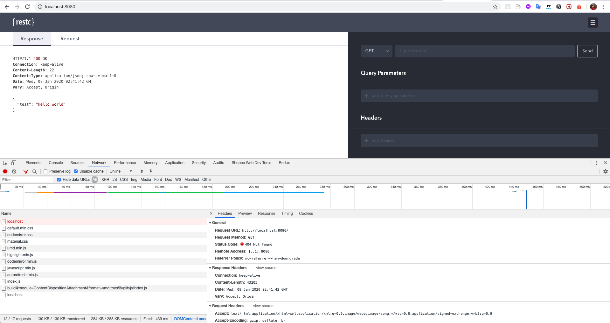
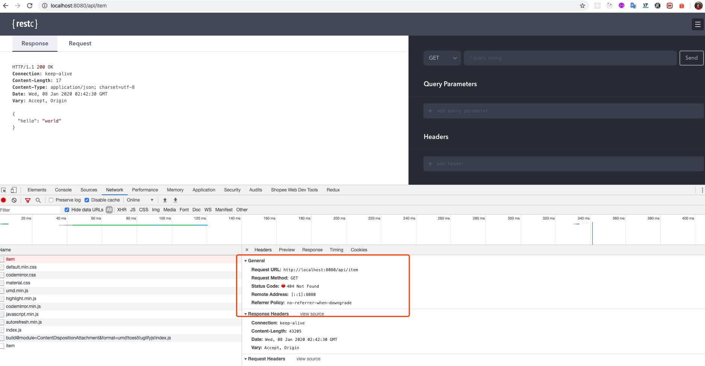

# restc-404-example

## Get Started

- yarn install
- yarn tsc
- yarn start

## 404 show case

When browse using browser like chrome directly, no errors would occur. But if the application running behind a reverse proxy server like nginx the 404 issue will lead to blank page, since if reponse status code is 404, nginx would not process the body.

